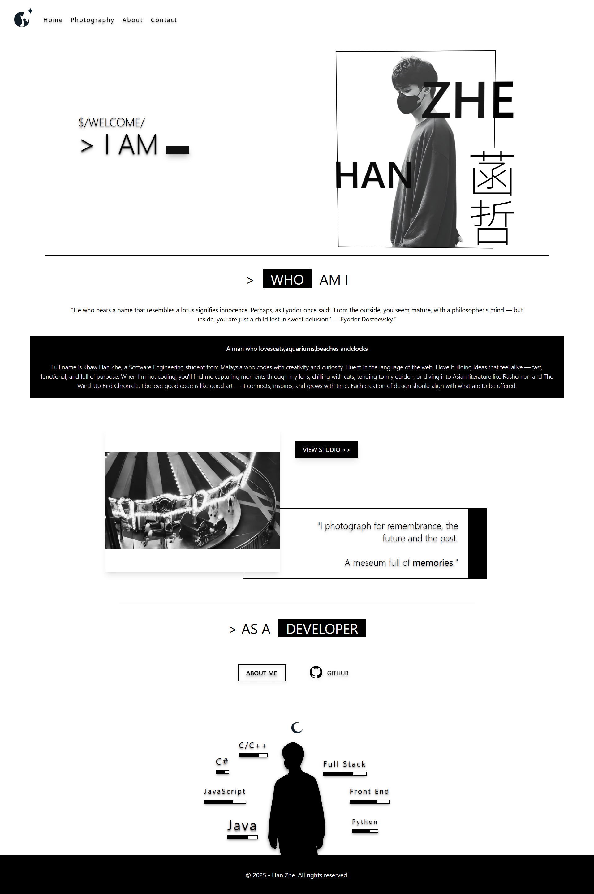
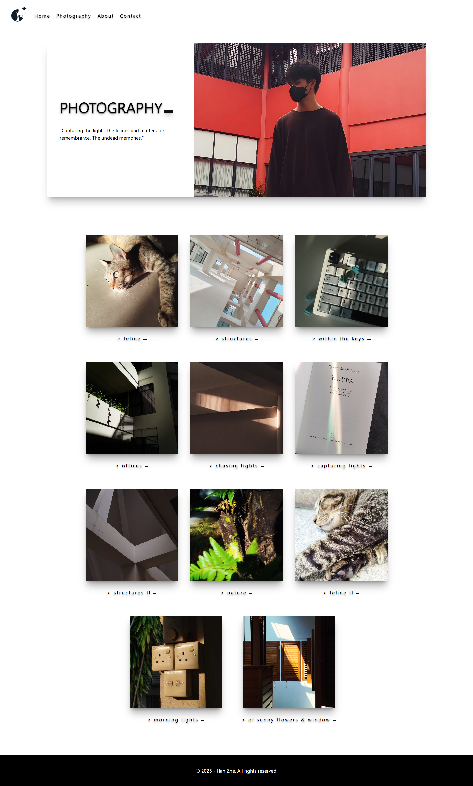
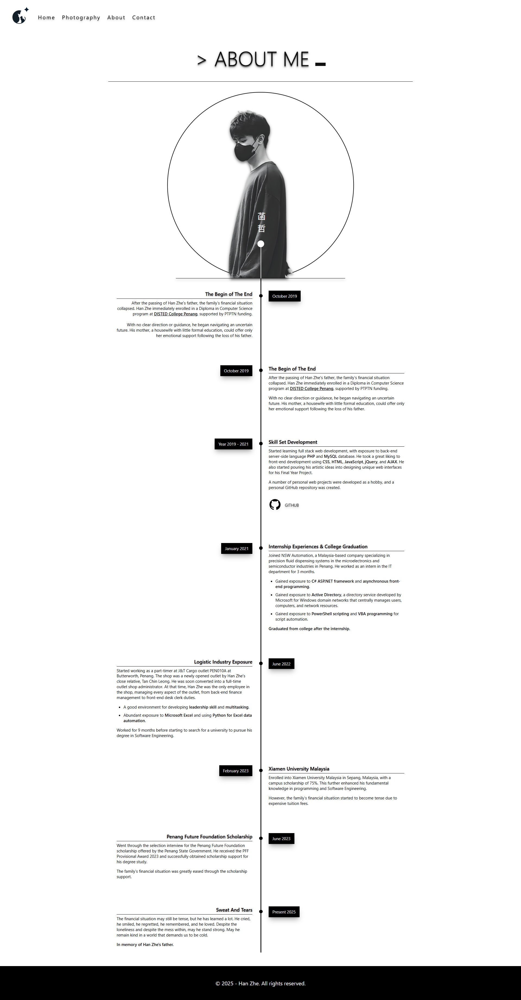
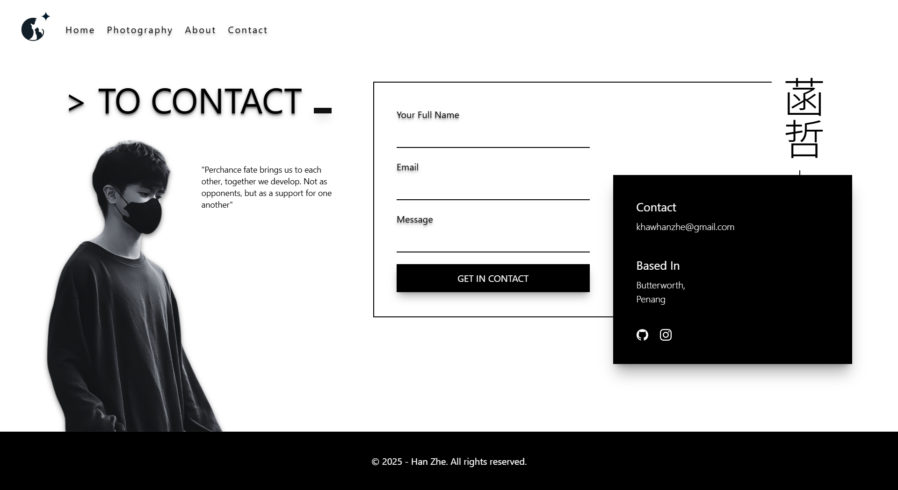

# Hanz Portfolio

A personal portfolio website for Han Zhe, designed to present personal identity, photography work, background story, development skills, and contact information through a clean monochrome visual style.

🌐 **Live Website:** [https://hanz02.github.io/hanz-portfolio/](https://hanz02.github.io/hanz-portfolio/)

---

## Preview

### Home Page



### Photography Page



### About Page



### Contact Page



---

## About the Project

This portfolio was built as a personal web project to express both technical and creative identity. The website combines minimalist black-and-white visuals, personal photography, timeline-based storytelling, and interactive page navigation.

The design focuses on a personal visual language using typography, photography, symbolic layout elements, and subtle animation effects.

---

## Pages

### Home

The home page introduces Han Zhe with a personal landing section, short self-description, photography highlight, and developer identity section.

### Photography

The photography page displays a curated gallery of personal photographs with captions and external links.

### About

The about page presents a timeline-style personal journey, including education, work exposure, scholarship experience, and software development growth.

### Contact

The contact page includes a contact form layout, personal email, location, and social media links.

---

## Features

- Responsive React-based single-page application
- Custom navigation bar
- GitHub Pages deployment
- Photography gallery layout
- Personal timeline section
- Contact form modal interaction
- Custom Tailwind CSS theme values
- Black-and-white minimalist design language
- Image-based visual identity and personal branding

---

## Tech Stack

- React
- Vite
- Tailwind CSS
- React Router
- GitHub Pages
- JavaScript
- HTML
- CSS

---

## Project Structure

```txt
hanz-portfolio
├── public
│   └── images
├── src
│   ├── css
│   ├── data
│   ├── pages
│   ├── App.jsx
│   └── main.jsx
├── package.json
├── vite.config.js
└── README.md
```
